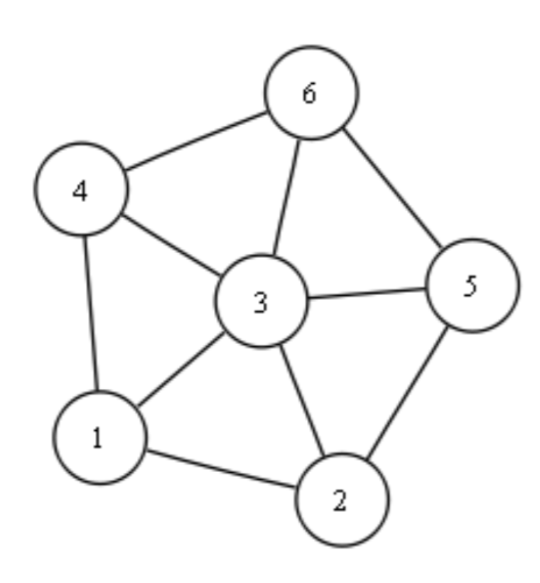
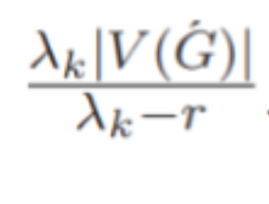
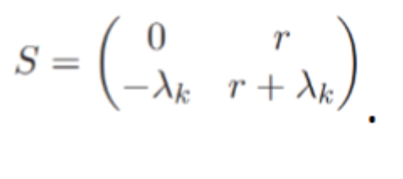
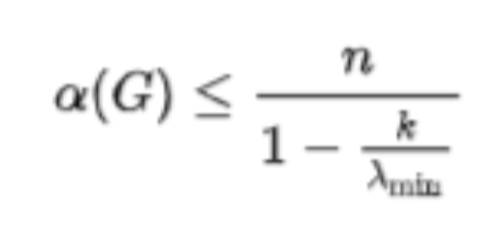
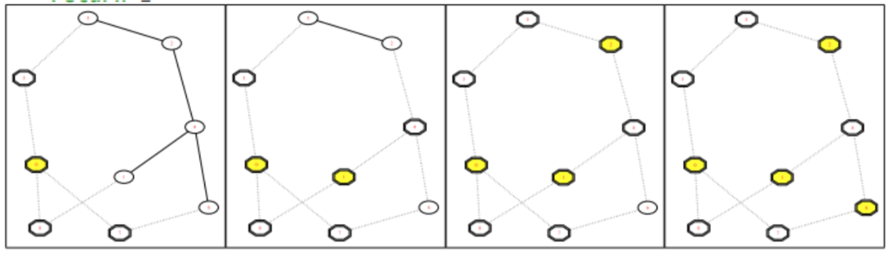

# Nadya_and_Katya.Spectral_properties_of_graphs

## Техническая библиотека: алгоритмы на графах, основанных на спектральных свойствах

**Постановка задачи:** Рассматриваем графы на n вершинах. Работаем с матрицей смежности графа, подаем ее на вход (nxn). Мы можем проверить спектральные свойства графа, а именно: 

Для данной матрицы {\displaystyle A}A, {\displaystyle \chi (\lambda )=\det(A-\lambda E)}\chi (\lambda )=\det(A-\lambda E), где {\displaystyle E}E — единичная матрица, является многочленом от {\displaystyle \lambda }\lambda , который называется характеристическим многочленом матрицы {\displaystyle A}A
> Для данной матрицы A $$, $\chi (\lambda )=\det(A-\lambda E) $$, где $ E $ — единичная матрица, является многочленом от $ \lambda $, который называется характеристическим многочленом матрицы $ A $.
Ценность характеристического многочлена в том, что собственные значения матрицы являются его корнями. Действительно, если уравнение $ Av=\lambda v $ имеет ненулевое решение, то $ (A-\lambda E)v=0 $, значит матрица $ A-\lambda E $ вырождена и её определитель $ \det(A-\lambda E)=\chi (\lambda ) $ равен нулю.

Связанные определения:

> Матрицу $ A-\lambda E $ называют **характеристической матрицей** матрицы $ A $.
> Уравнение $ \chi (\lambda )=0 $ называют **характеристическим уравнением** матрицы $ A $.
> **Характеристический многочлен графа** — это характеристический многочлен его матрицы смежности.

### 1. Найти собственные значения графа, собственные вектора 

Пусть L — линейное пространство над полем K, A:L->L — линейное преобразование.
Собственным вектором линейного преобразования A называется такой ненулевой вектор x∈L, что для некоторого 𝜆∈K Ax= 𝜆𝑥
Собственным значением (собственным числом) линейного преобразования A называется такое число 𝜆∈K , для которого существует собственный вектор, то есть уравнение Ax= 𝜆𝑥 имеет ненулевое решение x∈L.
Упрощённо говоря, собственный вектор — любой ненулевой вектор x, который отображается в коллинеарный ему вектор 𝜆x оператором A, а соответствующий скаляр 𝜆 называется собственным значением оператора.

### 2. Проверка на наличие треугольников в графе, нахождение всех треугольников в графе
Неориентированный граф G = (V, E) состоит из множества вершин V и множества связывающих их рёбер E. Одним из наиболее удобных видов представления графа является матрица смежности A, каждый элемент которой содержит число, определяющее наличие ребра между вершиной-строкой и вершиной-столбцом. Совокупность последовательно соединённых вершин графа, в которой первая и последняя вершины совпадают, называется циклом. Требуется найти алгоритм, эффективно перечисляющий все треугольники (циклы длины 3) некоторого графа.

Пример графа, содержащего треугольники:

В теории графов графом без треугольников называется неориентированный граф, в котором никакие три вершины не образуют треугольник из рёбер. Графы без треугольников можно определить также как графы с кликовым числом ≤ 2, графы с обхватом ≥ 4, графы без порождённых 3-циклов, или как локально независимые графы. По теореме Турана граф с n вершинами, не имеющий треугольников, с максимальным числом рёбер является полным двудольным графом, в котором число вершин в каждой доле графа близки настолько, насколько возможно.

Задача нахождения треугольников — это задача определения, содержит ли граф треугольники или нет. Если граф содержит треугольник, от алгоритма часто требуют вывести три вершины, которые образуют треугольник. Можно проверить, есть ли в графе с m рёбрами треугольники за время O(m^1.41). Другой подход — найти след матрицы A3, где A — это матрица смежности графа. След равен нулю в том и только в том случае, если в графе нет треугольников. Для плотных графов более эффективен этот простой алгоритм, основанный на умножении матриц, поскольку он снижает временную сложность до O(n^2.373), где n – число вершин. Как показали Имрих, Клавжар и Мулдер, распознавание графов без треугольников эквивалентно по сложности с распознаванием медианных графов. Однако на текущий момент лучшие алгоритмы медианных графов используют в качестве подпрограммы распознавание треугольников, а не наоборот. или задачи, где запросы к оракулу, запоминающему матрицы смежности графа, равна Θ(n^2). Однако для квантовых алгоритмов лучшая нижняя граница равна Ω(n), но лучший известный алгоритм имеет оценку O(n^1.29) .

### 3. Поиск числа независимости k-регулярного графа с помощью неравенства Хоффмана-Дельсарта 
Независимым подможеством вершин графа называется подмножество, не содержащее смежных вершин. 

**Утверждение** **(граница Дельсарта—Хоффмана)**. Пусть G — r-регулярный граф и λ_k — минимальное собственное число его матрицы смежности M. Тогда мощность любого независимого множества в графе G не превосходит . Независимое множество имеет мощность  тогда и только тогда, когда его характеристическая функция есть совершенная раскраска с матрицей параметров .

Существует оценка собственного значения для независимые множества в регулярные графа, первоначально из-за Алан Дж. Хоффман и Филипп Дельсарт.
Предположим, что G это k-регулярный граф на п вершины с наименьшим собственным значением λmin. Тогда: 
где α(G) обозначает его число независимости.

Эта граница была применена, чтобы установить, например, алгебраические доказательства Теорема Эрдеша – Ко – Радо и его аналог для пересекающихся семейств подпространств над конечными полями.

### 4. Поиск максимального по включению независимого множества

Определение: независимое множество I называется максимальным по включению, если оно не содержится в качестве собственного подмножества в другом независимом подмножестве в G. Задача нахождения максимального по мощности независимого множества N P-трудна. Однако для нахождения максимального по включению независимого множества существует тривиальный последовательный алгоритм с временной сложностью O(n).

Чтобы число итераций было небольшим, независимое множество S должно быть таким, чтобы S ∪ Γ(S) было большим.

Напрямую этого добиться трудно, но мы добиваемся того же эффекта, доказывая, что число ребер, инцидентных S ∪ Γ(S), составляет значительную долю остающихся ребер.

Для реализации этой идеи мы выбираем большое случайное множество вершин R ⊆ V. Маловероятно, что R будет независимым, но, с другой стороны, имеется немного ребер, оба конца которых принадлежат R. Для получения независимого множества из R мы рассмотрим такие ребра и удалим концевые вершины с меньшей степенью.

Эта идея реализована в алгоритме 31 (вероятностный параллельный алгоритм Луби нахождения максимального по включению независимого множества в графе). Предполагается, что каждой вершине и каждому ребру приписан свой процессор. Таким образом, требуемое число процессоров есть O(n+m). Через d(v) обозначается степень вершины v в графе, т. е. число инцидентных ей ребер.
